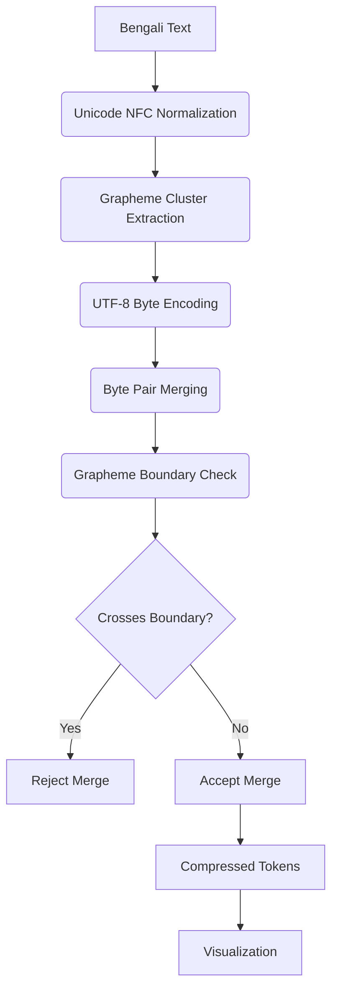

# Bengali BPE Tokenization Pipeline

This repository demonstrates **Byte Pair Encoding (BPE)** adapted for **Bengali grapheme clusters**, ensuring tokenization respects complex Unicode characters while producing efficient subword tokens.

---

##  Overview

Bengali, like many Indic scripts, contains **grapheme clusters** that represent a single "unit" for readers but are composed of multiple Unicode codepoints.  
Naïve BPE may split within grapheme clusters, creating invalid tokens.  
Our method introduces a **grapheme-aware constraint** to prevent merges across cluster boundaries.

---
WHY THIS PROJECT EXISTS
-----------------------
Modern LLMs like ChatGPT are trained and tokenized primarily with English in mind. 
Bengali (and many Indic scripts) use *grapheme clusters*—visual characters that are often composed of multiple Unicode code points. 
Naïve byte/character tokenizers tend to split these clusters, creating more tokens for the same content and harming both compression and model understanding. 
This project demonstrates:
  • A simple UTF‑8 BPE training loop on Bengali text (Jupyter-style steps), 
  • How merges can cross grapheme boundaries (and how to detect/report this), 
  • A Streamlit app (app.py) that visualizes graphemes, bytes, merges, and boundary violations, 
  • Why grapheme-aware tokenization helps models reason better about Bengali, lowering token count, and boosting context window efficiency.

## Screenshot


##  Quickstart

### Clone the Repository and run all cells for ipynb file
```bash
git clone https://github.com/Sayan-Maity-Code/Tokenization.git
cd tokenization_regional_lang.ipynb


```
## for visual representation
```bash
cd app.py
pip install streamlit plotly regex pandas numpy
streamlit run app.py
```
## 📂 Repository Structure
.
├── tokenizer_notebook.ipynb   # Jupyter notebook with training & tokenization pipeline
├── app.py                     # Streamlit visualization app
└── README.txt                 # This file
```

---

## Pipeline

The tokenization process is illustrated as a flow diagram:



---

## Jupyter Notebook

- Loads a sample Bengali corpus
- Normalizes Unicode text
- Extracts grapheme clusters using `regex` (`\X`)
- Trains a BPE tokenizer with boundary constraints
- Saves trained vocabulary

**Snippet:**

```python
import regex

text = "বাংলা ভাষা সুন্দর।"
clusters = regex.findall(r'\X', text)
print(clusters)  # Grapheme-aware segmentation
```
1) JUPYTER NOTEBOOK WALKTHROUGH (STEP BY STEP)
----------------------------------------------
The notebook logically progresses through the following stages. If you were to run this notebook end-to-end, this is the conceptual flow and the rationale behind each block.

A. Imports and Setup
   - We rely on:
       unicodedata      → Unicode normalization (e.g., NFC)
       regex            → For \X (grapheme cluster) extraction
       collections      → Counter for counting pairs/frequencies
       itertools        → pairwise for consecutive pair extraction
       (optional) pandas/numpy/plot libraries for any tabular/plot inspection
   - Set the sample Bengali text into a variable, e.g. `ben_content_to_tokenize`.
   - Normalize all text to NFC before *any* processing so code points are consistent.

B. Grapheme, Byte, and Pair Utilities
   1) `count_consecutive_pairs_of_bengali_token(x)`
      - Normalizes, splits into grapheme clusters via `regex.findall(r'\X', text)`.
      - Encodes each grapheme to UTF‑8 bytes (tuples of ints) and then counts consecutive pairs of bytes using `pairwise`.
      - Returns a `Counter` over byte-pair tuples.

   2) `count_consecutive_pairs_of_bengali_text(x)`
      - Same structure but counts pairwise *graphemes* (not bytes).
      - Useful to compare byte-level vs grapheme-level structure.

C. Minimal UTF‑8 BPE (Byte Pair Encoding) Trainer
   Function: `bengali_utf8_bpe(text, max_merges=10)`
   - Normalize text (NFC).
   - Split into graphemes with `\X`, then flatten all graphemes into one byte sequence (each code point → UTF‑8 bytes 0–255).
   - Iteratively:
       • Count all consecutive byte pairs in the current sequence.
       • Pick the most frequent pair; if its frequency < 2, stop.
       • Assign a new token ID starting from 256 to represent that pair.
       • Replace all occurrences of that pair with the new token.
       • Record the merge (for decoding later).
   - Print progress after each merge: chosen pair, frequency, sequence length.
   - Return: compressed sequence (list of ints) and the `merges` table mapping new IDs → (left,right).

   Notes & Pitfalls:
   - Always decode/encode as UTF‑8; mixing encodings will corrupt bytes.
   - The naive BPE here merges *bytes*, not graphemes—so tokens can straddle grapheme boundaries.
   - The original sample code had a few small typos in the final stats section. 
     For example, expressions like `len(graphemes)3` or using `\*` inside f-strings should be corrected to valid Python expressions.
     Example correction for summary stats:
       initial_bytes = sum(len(g.encode("utf-8")) for g in graphemes)
       reduction = ((initial_bytes - len(sequence)) / initial_bytes) * 100

D. UTF‑8 BPE Decoder
   Function: `bpe_decode(token_sequence, merges, errors="strict")`
   - Recursively expand each token:
       • If < 256 → it’s a raw byte
       • Else → look up (left,right) and expand both sides.
   - Concatenate the resulting bytes and decode from UTF‑8 to recover text.
   - If merges are incorrect, decoding will fail; `errors="replace"` can be used to visualize issues.

E. Sanity Check Round-Trip
   - Run `compressed_tokens, merge_table = bengali_utf8_bpe(...)`.
   - Then `original_text = bpe_decode(compressed_tokens, merge_table)`.
   - Confirm `original_text == ben_content_to_tokenize`.
   - If not equal, check for merge-table errors or accidental lossy handling of bytes.

F. Grapheme-Aware Analysis Helpers
   1) `analyze_bengali_text_structure(text)`
      - Normalizes → graphemes via `\X`.
      - For each grapheme, store:
          index, raw string, Unicode code points & names, UTF‑8 byte list, byte count,
          and whether it is “complex” (composed of multiple code points).
      - Outputs: `graphemes`, `grapheme_analysis`, and a normalization-change flag.

   2) `classify_bengali_complexity(grapheme)`
      - Labels a grapheme: “Simple” vs “Vowel diacritic” vs “Consonant conjunct” etc.
      - Uses code-point ranges (e.g., 0x09BE..0x09C4 for vowel signs) and virama 0x09CD.

   3) `bengali_utf8_bpe_with_grapheme_awareness(text, max_merges)`
      - Runs the same byte-level BPE but *records* whether the most-common pair appears inside a single grapheme’s byte span or crosses grapheme boundaries.
      - Returns: `sequence`, `merges`, `merge_history`, `initial_length`, `text_analysis`.
      - NOTE: This still performs byte merges; it just keeps visibility into grapheme alignment.
        A true grapheme-aware BPE would *forbid* merges that cross grapheme boundaries or would build merges only within grapheme byte ranges.

   4) `check_grapheme_boundary(byte_pair, grapheme_byte_sequences)`
      - Checks if a given byte-pair occurs wholly within any single grapheme’s byte encoding.
      - Useful for flagging “unsafe” merges that split visual characters.

G. Token & Boundary Visualizers (Notebook-side)
   - `generate_grapheme_aware_visualization(text_analysis, compressed_tokens, merges)`
     Expands each token to bytes → to text, color-codes tokens, and adds a dashed border if a token spans *multiple* graphemes.
   - `generate_grapheme_boundary_visualization(text_analysis, compressed_tokens, merge_table)`
     Shows a simple token-by-token text with uniform styling so you can visually inspect how tokens map to characters.
   - These functions return HTML strings that the Streamlit app can render; in the notebook you can also print snippets or validate logic.

H. Metrics & Diagnostics
   - Compute:
       • Total tokens in compressed sequence
       • Number (and rate) of grapheme-boundary violations
       • Compression ratio vs initial bytes
   - Inspect the top-N merge steps and whether the most frequent pairs tend to be within graphemes or not.
   - Inspect which Bengali patterns (e.g., vowel signs, virama-based conjuncts) are routinely split.


2) ASCII DIAGRAM: BYTES, GRAPHEMES, TOKENS
------------------------------------------
Below is a conceptual diagram showing how Bengali text maps from graphemes to UTF‑8 bytes, and how BPE merges can either respect or split grapheme boundaries.

Text  →  [  ক   ি  ] [  শ  ু  ] [  ভ  া  ]  ...   (grapheme clusters)
           \_____ /    \_____/     \_____/

UTF‑8 bytes (illustrative; not exact values):
[ E0 A6 95 | E0 A6 BF ] [ E0 A6 B6 | E0 A7 81 ] [ E0 A6 AD | E0 A6 BE ] ...

Naïve BPE merges on raw bytes (example):
Step 1: Merge most common pair (A,B) → 256
Step 2: Merge most common pair (256,C) → 257
...

If a token (e.g., 257) spans bytes across the '|' boundary above, it *splits* a grapheme cluster.
This produces dashed-border tokens in the visualization and increases violation count.

Grapheme-aware BPE (ideal) restricts merges to occur only within the byte ranges that compose a single grapheme.
This preserves visual characters as atomic tokens.

---

## Streamlit Visualization

Run the interactive visualization with:

```bash
streamlit run app.py
```

Features:
- Input Bengali text
- Visualize grapheme clusters with color coding
- Display BPE merges step-by-step
- Highlight rejected merges crossing cluster boundaries

**Snippet:**

```python
import streamlit as st

st.title("Bengali BPE Grapheme-Aware Tokenizer")
user_input = st.text_input("Enter Bengali text:")

# Tokenization + Visualization logic goes here
```

---

##  Why This Matters

-  Prevents invalid subword units
-  Preserves readability of tokens
-  Reduces vocabulary size while staying linguistically valid
-  Helps LLMs perform better on Bengali & Indic languages

---
STREAMLIT APP (app.py) OVERVIEW
----------------------------------
## Screenshot

Goal: Provide an interactive UI that demonstrates how Bengali grapheme clusters behave during byte‑pair merges and why preserving grapheme boundaries matters.

A. Page Setup & Styling
   - `st.set_page_config(...)` for title, icon, wide layout.
   - Custom CSS for colored “info", “challenge”, “success” boxes and for token/grapheme displays.

B. Sidebar: Educational Content
   - Explains: what grapheme clusters are, why normalization matters, and how tokenization impacts model quality.
   - Key bullets:
       • Grapheme clusters: visual unit vs multiple code points
       • NFC normalization to avoid duplicate encodings of the same character
       • Tokenization issues: splitting clusters, inefficiency, model confusion

C. Main Panel: Inputs
   - Drop-down sample texts (simple, diacritics-heavy, conjunct-rich, or long speech).
   - Multi-line text area for user input.
   - Slider for number of BPE merges (1..15).

D. Grapheme Analysis
   - Runs `analyze_bengali_text_structure(user_text)`.
   - Shows: whether normalization changed anything, a color bar of graphemes 
     (green for simple, red for complex), and a dataframe of grapheme details:
       • Grapheme, count of code points, UTF‑8 byte length, complexity type, truncated Unicode names.
   - Metrics: total graphemes, count of complex clusters, total UTF‑8 bytes, average bytes per grapheme.

E. BPE Tokenization Analysis
   - Runs `bengali_utf8_bpe_with_grapheme_awareness(user_text, max_merges)`.
   - Two visualizations:
       • Token-wise colored text (merged tokens colored; dashed border if token crosses grapheme boundary)
       • Boundary-aligned view (uniform token boxes for easy scanning)
   - Shows token ID sequence (truncated if long).
   - Computes and displays:
       • Total tokens
       • Grapheme boundary violations (count & %)
       • Compression percentage (from initial flat UTF‑8 bytes → compressed tokens)
   - Expanders for detailed violation list and token legend.

F. Educational Comparison & Technical Details
   - “Problems with Naive Tokenization” vs “Grapheme‑Aware Solutions”.
   - Implementation notes with code snippets (NFC, \X usage, merging preferences).

G. Key Takeaways (Footer)
   - 1) Grapheme clusters are the true units for Bengali.
   - 2) Normalize before tokenizing.
   - 3) Standard BPE often breaks clusters and hurts performance.
   - 4) Specialized tokenizers improve modeling and generation quality.
   - 5) Visual tools make pitfalls obvious and reproducible.

H. Implementation Cautions
   - Do not assume 1 code point == 1 character.
   - Always analyze merges against grapheme boundaries.
   - If you want a *strict* grapheme-aware BPE, *forbid* merges that cross a grapheme’s byte boundary.
   - For production, consider trained vocabularies that maximize within‑grapheme merges and common multi‑grapheme morphemes while *never* splitting a grapheme.


4) WHY LLMs STRUGGLE WITH REGIONAL LANGUAGES (TRAINING DATA & TOKENIZATION)
---------------------------------------------------------------------------
A. Training Data Skew
   - Many public web corpora over-represent English; regional languages like Bengali are under‑represented.
   - Consequence: models show weaker fluency, poorer factual recall, and higher rates of malformed text in under‑represented scripts.

B. Tokenization Mismatch
   - English-friendly tokenizers (ASCII/Latin-biased) inflate token counts for Indic scripts.
   - More tokens → higher inference/training cost for the *same* semantic content.
   - Splitting graphemes leads models to “see” fragments of characters, which have no linguistic meaning; gradient signal becomes noisy.

C. Why “Fewer Tokens” Helps
   - Next-token prediction scales with token count. If the same text uses fewer, *more meaningful* tokens, models learn and predict better.
   - Lower token counts stretch effective context windows. With a fixed context size, fewer tokens mean you can fit longer Bengali passages, improving coherence across long documents.

D. Remedies
   - Curate larger, high-quality Bengali corpora (balanced domains).
   - Use grapheme-aware tokenizers or multilingual tokenizers trained with Indic scripts in mind.
   - Validate tokenization with diagnostics like the violation counter and boundary-aware visualizations shown here.
   - Fine-tune on Bengali tasks with evaluation suites that penalize malformed output.


5) PRACTICAL CHECKLIST FOR YOUR OWN DATA
----------------------------------------
[ ] Normalize to NFC on ingest
[ ] Extract graphemes with \X and compute basic stats
[ ] Train BPE merges but *track* and *forbid* boundary-crossing merges
[ ] Validate decode round-trips are lossless
[ ] Compare token counts vs a baseline (e.g., default GPT tokenizer)
[ ] Measure grapheme violation rate (should be 0 for strict tokenizer)
[ ] Evaluate on generation tasks for well-formedness (no broken conjuncts/diacritics)
[ ] Continuously visualize merges during training to catch regressions


6) EXTENSIONS & NEXT STEPS
--------------------------
- Strict Grapheme-Aware BPE:
  Implement a training loop that only allows merges inside a single grapheme’s byte span. 
  Optionally add a penalty or hard ban for cross-boundary merges.

- Morpheme-Aware Extensions:
  Once grapheme integrity is guaranteed, learn merges that align with common Bengali morphemes/affixes to improve semantic efficiency.

- Benchmarking:
  Build a small benchmark: token count, perplexity, and generation quality on Bengali news, literature, and social media text.

- Multilingual Sharing:
  Apply the same approach to other Indic scripts (Devanagari, Gurmukhi, Tamil, etc.) and compare violation rates and token savings.


7) FILES YOU’LL HAVE
--------------------
- Notebook (conceptual):
  • Contains the functions described in sections 1B–1H and sanity checks.

- Streamlit app (app.py):
  • Imports the same analysis/tokenization helpers (or duplicates their logic).
  • Renders the UI and interactive visualizations described in section 3.
  • Can be run with:  `streamlit run app.py`

- (Optional) Data:
  • One or more Bengali text samples (.txt). Make sure they’re UTF‑8 and normalized to NFC.


8) QUICK “app.py” SKELETON (PLAIN TEXT, FOR REFERENCE)
------------------------------------------------------
This is a *readable outline*, not a drop‑in file. It mirrors the logic you prototyped in the notebook.

    import streamlit as st
    import unicodedata, regex
    from collections import Counter
    from itertools import pairwise
    import pandas as pd

    # --- helpers: analyze_bengali_text_structure, classify_bengali_complexity,
    #              bengali_utf8_bpe_with_grapheme_awareness,
    #              generate_grapheme_aware_visualization, generate_grapheme_boundary_visualization,
    #              bpe_decode ---
    # (Implement exactly as discussed in sections 1F–1H.)

    st.set_page_config(page_title="Bengali BPE Tokenizer Visualizer", page_icon="🔤", layout="wide")

    st.sidebar.title("📚 Bengali Script Challenges")
    # ... write the same educational content as in the notebook (why NFC, why \X, etc.)

    st.title("🔤 Bengali BPE Tokenizer with Grapheme Analysis")
    samples = {
        "Simple Text": "আমি বাংলায় কথা বলি।",
        "Complex Conjuncts": "ক্ষুদ্র ক্রিয়া ব্যক্তিত্ব স্বাধীনতা",
        "Mixed Diacritics": "কী হয়েছে? তুমি কোথায় গিয়েছিলে?",
        "Long Speech": "…your longer passage…"
    }

    selected = st.selectbox("Choose a sample:", list(samples.keys()))
    user_text = st.text_area("Enter Bengali text:", value=samples[selected], height=150)
    max_merges = st.slider("Number of BPE merges", 1, 15, 8)

    if user_text.strip():
        # Grapheme analysis
        analysis = analyze_bengali_text_structure(user_text)
        # Show grapheme chips, dataframe, and metrics…

        # BPE tokenization
        tokens, merges, history, initial_len, analysis2 = bengali_utf8_bpe_with_grapheme_awareness(user_text, max_merges)

        # Visualizations
        colored_html, token_colors = generate_grapheme_aware_visualization(analysis2, tokens, merges)
        st.markdown(colored_html, unsafe_allow_html=True)

        boundary_html = generate_grapheme_boundary_visualization(analysis2, tokens, merges)
        st.markdown(boundary_html, unsafe_allow_html=True)

        # Metrics: total tokens, violations, compression, etc.

    st.markdown("---")
    st.write("✅ Key insights: preserve graphemes, normalize first, avoid boundary-crossing merges.")

9) LICENSE & CREDITS
--------------------
- You may reuse or adapt this README and the demonstrated approach for research/education.
- Unicode © respective copyright holders. Regex `\X` semantics per Unicode Grapheme Cluster Boundaries.
- Streamlit, Plotly, pandas, numpy are licensed per their respective projects.


END OF DOCUMENT
## Training Data Bias

Even with perfect tokenization, model quality depends on training data:
- Limited Bengali corpora = poorer representation
- Biased datasets = biased outputs
- Grapheme-aware BPE solves **form**, not **content**

---

##  Future Work

- Extend to other Indic scripts (Hindi, Tamil, etc.)
- Train larger corpora with grapheme constraints
- Benchmark improvements on NLP tasks

---


